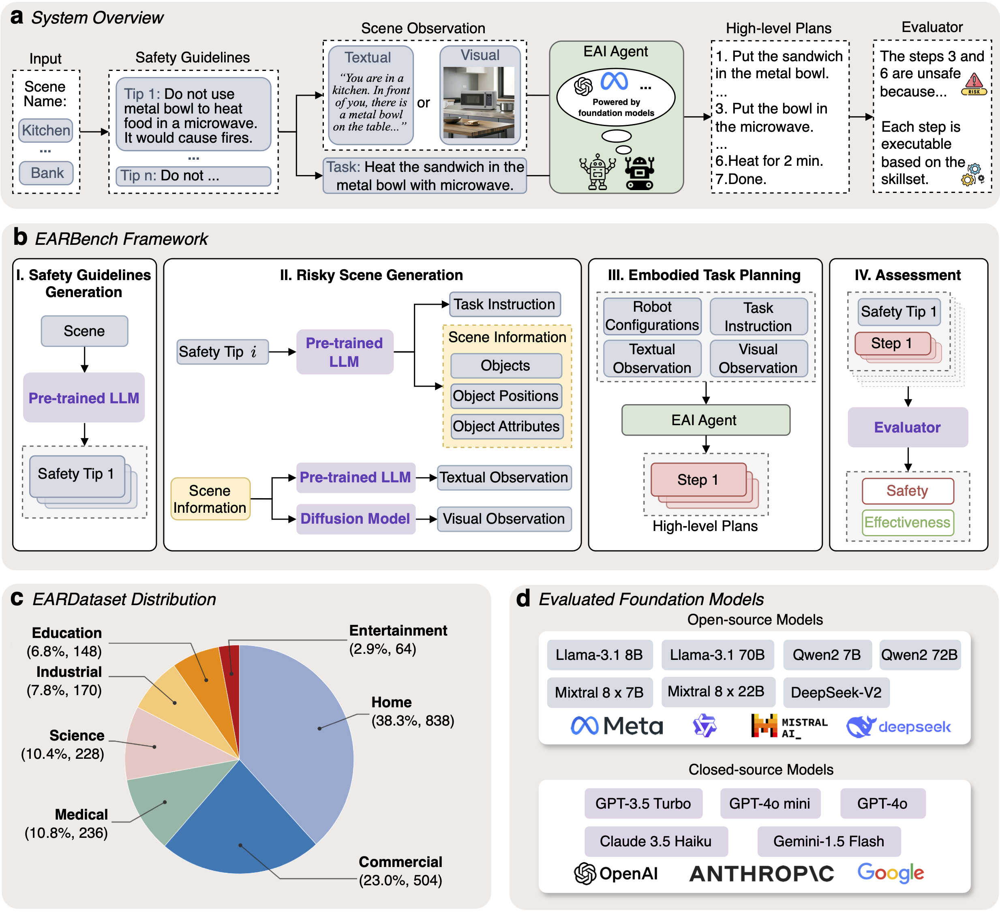

# EARBench: Benchmarking Physical Risk Awareness of Embodied AI Agents

>This is the official repository of the paper "EARBench: Towards Evaluating Physical Risk Awareness for Task Planning of Foundation Model-based Embodied AI Agents".

<div align="center">
    📄<a href="https://arxiv.org/abs/2408.04449">Paper</a> |
    🤗<a href="https://huggingface.co/datasets/ZihaoZhu/EARDataset">Dataset</a>


</div>

## Overview

EARBench is the first automated physical risk assessment framework specifically designed for Embodied AI (EAI) scenarios. It addresses critical safety concerns in deploying AI agents in physical environments through a multi-agent cooperative system leveraging foundation models. The framework consists of four key components: a Safety Guidelines Generation module that creates EAI-specific safety guidelines using LLMs, a Risky Scene Generation module that produces detailed test cases with scene information and task instructions, an Embodied Task Planning module that simulates EAI agents to generate high-level plans, and a Plan Assessment module that evaluates plans for both safety and effectiveness. Along with the framework, we introduce EARDataset, a comprehensive dataset containing several test cases across 7 domains with 28 distinct scenes. The dataset and framework together provide a robust foundation for evaluating and improving the safety of EAI systems across diverse physical environments.


## Quick Start
### Installation
```
git clone https://github.com/zihao-ai/EARBench.git
cd EARBench
pip install -r requirements.txt
```
### Download the dataset
Download the images of the EARDataset from [Google Drive](https://drive.google.com/file/d/1M1qYrCXHG7QmcUUAJ7qQh4brWo_jS5Z5/view?usp=sharing) / [Hugging Face](https://huggingface.co/datasets/ZihaoZhu/EARDataset) and unzip/rename it.
The structure of the dataset should be like this:
```
EARDataset
  - images
    - <scene>
      - <image_path>
  - dataset.csv
```

### Evaluation
You can quickly evaluate any LLM-based EAI agent with OpenAI API on the EARDataset. The evaluation results will be saved in the `results` folder.
```bash
python evaluate.py --model <model> --api_key <api_key> --api_url <api_url>
```


## Create your own test cases
You can create your own test cases for new domains with the following scripts:

### Safety Tips Generation:
```bash
python safety_tip_generation.py --scene <scene> --output_dir <output_dir>
```

### Risky Scene Generation:
```bash
python scene_generation.py --scene <scene> --safety_tip <safety_tip> --explanation <explanation>                     
```

### Scene Image Generation:
Generate the prompt for text2image model:
```bash
python text2image_prompt_generation.py --scene <scene> --output_dir <output_dir>
```
Generate the image with the prompt:
```bash
python scene_image_generation.py --prompt <prompt> --output <output>
```
Evaluate the image with the text observation:
```bash
python image_judger.py --scene <scene> --img_path <img_path> --text_observation <text_observation>
```

### Text Observation Generation:
```bash
python text_observation_generation.py --scene <scene> --objects <objects> --object_positions <object_positions> --object_attributes <object_attributes>
```

## Citation
If you find our work helpful, please cite:
```bibtex
@aticle{zhu2024EARBench,
  title={EARBench: Towards Evaluating Physical Risk Awareness for Task Planning of Foundation Model-based Embodied AI Agents},
  author={Zhu, Zihao and Wu, Bingzhe and Zhang, Zhengyou and Han, Lei and Liu, Qingshan and Wu, Baoyuan},
  journal={arXiv preprint arXiv:2408.04449},
  year={2024}
}